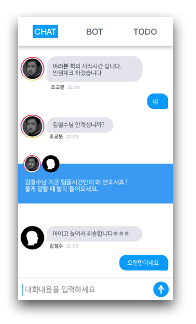
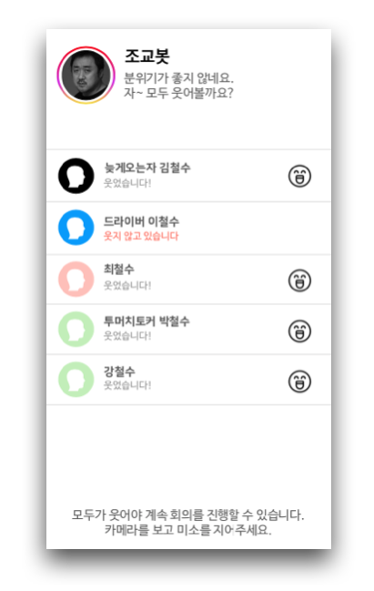
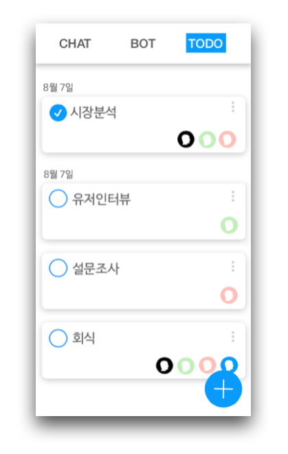

## MCBot-android

### 2018.8.11 Gokathon🔥

조별과제를 쉽고 재밌게 할 수 있도록 Bot과 투두리스트 기능을 제공하는 안드로이드 어플입니다.

[Flask Server Repository](https://github.com/yebonkim/MCBot-server)

### 주요 기능
- 채팅
- MC봇
- 투두리스트

### 주요 사용 기술

- Firebase
- Naver 얼굴인식 API

### 3가지 봇

- 자기소개 유도등 조별과제 진행을 위한 **MC봇**
- 회의를 위한 날짜 및 장소 선택을 돕는 **조교봇**
  - Naver 얼굴인식 API를 통한 불시 표정 체크 
- 각 멤버 채팅 특징에 따라 칭호를 부여하는 **칭호봇**
  - 가장 활발히 참여하는 멤버
  - 잠수하는 멤버
  - 경조사가 많은 멤버
  - 채팅이 없는 멤버

### 주요 사용 화면

  
  

  
  

